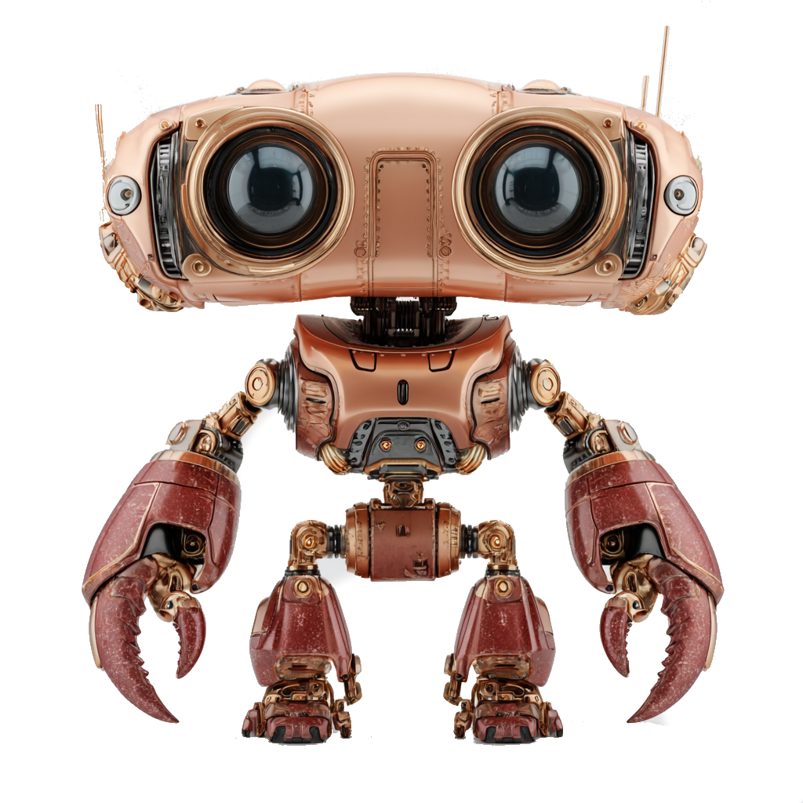

<p align="center">
  
</p>

<h1 align="center">🦏 RhinoClaw</h1>

<p align="center">
  <strong>AI-powered control for Rhino 3D</strong>
</p>

<p align="center">
  
  
  
  
  
</p>

<p align="center">
  Control Rhino 3D with AI agents — 72 tools for geometry, transforms, booleans, materials, Grasshopper, and more.<br/>
  Works with <a href="https://openclaw.ai">OpenClaw</a>, Claude, Cursor, or any MCP-compatible AI.
</p>

---

## What is RhinoClaw?

RhinoClaw connects AI agents directly to Rhino 3D. It consists of two parts:

1. **Rhino Plugin** (`.rhp`) — a C# plugin that runs inside Rhino and exposes a TCP/WebSocket server
2. **Python Server** — an MCP (Model Context Protocol) server that translates AI tool calls into Rhino commands

Together, they give any AI agent full control over Rhino: create geometry, manage layers, apply materials, run Grasshopper definitions, capture viewports, and much more.

<!-- 
<p align="center">
  
</p>
-->

### Key Features

- 🎨 **72 Tools** across 12 categories
- 🔌 **MCP Protocol** — works with any MCP-compatible AI client
- 🏠 **Fully Local** — no cloud required, runs on your machine
- 🦗 **Grasshopper Integration** — load definitions, set parameters, solve, bake
- 🎭 **PBR Materials** — full physically-based rendering material support
- 📸 **Viewport Capture** — screenshots with annotations
- 💬 **Embedded Chat Panel** — chat with AI directly inside Rhino 8
- 🔗 **TCP + WebSocket** — real-time bidirectional communication

---

## Requirements

| Requirement | Details |
|---|---|
| **Rhino** | Version 7 or 8 (Windows) |
| **Python** | 3.10 or higher |
| **pip** | For installing the Python server |
| **Network** | localhost or LAN connection between AI and Rhino |

---

## Installation

### Step 1: Install the Rhino Plugin

1. Download `rhinoclaw.rhp` from the [`plugin/`](plugin/) folder or from [Releases](https://github.com/McMuff86/rhinoclaw-release/releases)
2. In Rhino, run the command: `_PlugInManager`
3. Click **Install** → select `rhinoclaw.rhp`
4. Restart Rhino
5. Verify: type `RhinoClawVersion` in the Rhino command line

### Step 2: Install the Python Server

```bash
# Clone this repository
git clone https://github.com/McMuff86/rhinoclaw-release.git
cd rhinoclaw-release/rhinoclaw_server

# Install (editable mode for development, or regular install)
pip install -e .
# or: pip install .

# Start the server
rhinoclaw --host localhost --port 1999
```

### Step 3: Configuration

```bash
# Copy the example config
cp config.example.json config.json

# Edit to match your setup
# - host: "localhost" for local, or your machine's IP for remote
# - port: 1999 (default)
# - screenshots.output_dir: where to save viewport captures
```

### Step 4: Connect

1. In Rhino, type `tcpstart` (for network access) or `mcpstart` (for local MCP)
2. The server will show `Connected to Rhino at ...`
3. Done! Your AI agent can now control Rhino.

> **Remote Access:** For connecting over a network (e.g., WSL2, Tailscale), use the machine's IP address instead of `localhost` in the config.

---

## Usage Examples

### Create a Sphere

```
AI: "Create a red sphere at the origin with radius 5"
→ Tool: create_object(type="sphere", center=[0,0,0], radius=5)
→ Tool: create_material(name="Red", color=[255,0,0])
→ Tool: assign_material_to_layer(...)
```

### Boolean Operations

```
AI: "Subtract box B from box A"
→ Tool: boolean_operation(operation="difference", input_a="<guid-A>", input_b="<guid-B>")
```

### Grasshopper Integration

```
AI: "Load the door definition and set width to 900mm"
→ Tool: load_grasshopper_definition(path="C:/definitions/door.gh")
→ Tool: set_grasshopper_parameter(component="Width", value=900)
→ Tool: solve_grasshopper()
→ Tool: bake_grasshopper(layer="Doors")
```

### Viewport Screenshot

```
AI: "Take a perspective screenshot at 1920x1080"
→ Tool: capture_viewport(width=1920, height=1080, view="Perspective")
```

---

## Embedded Chat Panel (ClawChat)

RhinoClaw includes an embedded chat panel for Rhino 8 that lets you interact with AI directly inside the Rhino viewport.

### Features
- Chat with AI without leaving Rhino
- Configurable AI backend (OpenClaw, Ollama, OpenAI, etc.)
- Context-aware — the AI knows about your current Rhino document
- Real-time tool execution feedback

### Setup
1. In Rhino 8, the ClawChat panel appears automatically after plugin installation
2. Configure your AI backend in the panel settings
3. Start chatting — the AI has access to all 72 RhinoClaw tools

---

## Available Tools (72)

### 🏗️ Geometry Creation (14 Tools)
| Tool | Description |
|---|---|
| `create_object` | Create sphere, box, cylinder, cone, torus, pipe, ellipsoid |
| `create_objects` | Batch create multiple objects |
| `extrude_curve` | Extrude a curve along a direction |
| `loft_curves` | Loft between multiple curves |
| `revolve_curve` | Revolve a curve around an axis |
| `mesh_from_brep` | Convert Brep to mesh |
| `offset_curve` | Offset a curve |
| `fillet_curves` | Fillet between curves |
| `chamfer_curves` | Chamfer between curves |
| `create_text` | Create 3D text |
| `create_text_dot` | Create text dot annotation |
| `create_leader` | Create leader annotation |
| `create_linear_dimension` | Create linear dimension |
| `create_angular_dimension` | Create angular dimension |

### 🔄 Transforms (7 Tools)
| Tool | Description |
|---|---|
| `modify_object` | Move, rotate, scale a single object |
| `modify_objects` | Batch transform multiple objects |
| `copy_object` | Copy/duplicate objects |
| `mirror_object` | Mirror objects across a plane |
| `array_linear` | Create linear array |
| `array_polar` | Create polar array |
| `create_radial_dimension` | Create radial dimension |

### ✂️ Boolean Operations (1 Tool, 4 Operations)
| Tool | Description |
|---|---|
| `boolean_operation` | Union, Difference, Intersection, Split |

### 🎨 Materials & PBR (3 Tools)
| Tool | Description |
|---|---|
| `create_material` | Create material with color and PBR properties |
| `assign_material_to_layer` | Assign material to a layer |
| `set_render_settings` | Configure render settings |

### 📂 Layers (4 Tools)
| Tool | Description |
|---|---|
| `create_layer` | Create a new layer |
| `delete_layer` | Delete a layer |
| `get_or_set_current_layer` | Get or set the current layer |
| `add_light` | Add a light to the scene |

### 🦗 Grasshopper (8 Tools)
| Tool | Description |
|---|---|
| `load_grasshopper_definition` | Load a .gh definition |
| `unload_grasshopper_definition` | Unload a definition |
| `list_grasshopper_definitions` | List loaded definitions |
| `set_grasshopper_parameter` | Set component parameters |
| `get_grasshopper_outputs` | Read component outputs |
| `solve_grasshopper` | Solve the definition |
| `bake_grasshopper` | Bake geometry to Rhino |
| `run_grasshopper` | Run a definition with GrasshopperPlayer |
| `grasshopper_interactive` | Interactive Grasshopper session |

### 📸 Viewport & Camera (5 Tools)
| Tool | Description |
|---|---|
| `capture_viewport` | Screenshot of the viewport |
| `set_view` | Set named view (Top, Front, Perspective, etc.) |
| `set_camera` | Set camera position and target |
| `orbit_camera` | Orbit the camera |
| `render_view` | Render the current view |

### 🔍 Selection & Groups (5 Tools)
| Tool | Description |
|---|---|
| `select_objects` | Select objects by criteria |
| `get_selected_objects_info` | Info about selected objects |
| `create_group` | Group objects together |
| `ungroup` | Ungroup objects |
| `get_object_info` | Detailed object information |

### 📦 Blocks (3 Tools)
| Tool | Description |
|---|---|
| `create_block` | Create a block definition |
| `insert_block` | Insert a block instance |
| `explode_block` | Explode a block |

### 💾 Import/Export & Files (4 Tools)
| Tool | Description |
|---|---|
| `import_mesh` | Import mesh files (OBJ, STL, etc.) |
| `export_mesh` | Export mesh files |
| `export_file` | Export to various formats (STEP, IGES, 3DM, etc.) |
| `open_file` | Open a Rhino file |
| `save_file` | Save the current file |

### 🔧 Object Properties (3 Tools)
| Tool | Description |
|---|---|
| `get_object_properties` | Get object properties |
| `set_object_properties` | Set object properties |
| `delete_object` | Delete objects |

### 📊 Document & Session (6 Tools)
| Tool | Description |
|---|---|
| `get_document_info` | Document summary (objects, layers, materials) |
| `get_session_stats` | Session statistics |
| `get_command_history` | Recent command history |
| `get_logs` | Server logs |
| `zoom_extents` | Zoom to fit all objects |
| `zoom_selected` | Zoom to selected objects |

### 🐍 Scripting (4 Tools)
| Tool | Description |
|---|---|
| `execute_rhinoscript_python_code` | Execute Python code in Rhino |
| `get_rhinoscript_python_code_guide` | Get RhinoScript API guide |
| `get_rhinoscript_python_function_names` | List available functions |
| `stream_commands` | Stream multiple commands |

### 🛠️ Utility (3 Tools)
| Tool | Description |
|---|---|
| `ping` | Test connection to Rhino |
| `set_debug_mode` | Toggle debug logging |
| `log_thought` | Log agent reasoning (for debugging) |

---

## Configuration Reference

The `config.json` file supports the following settings:

```json
{
  "connection": {
    "host": "localhost",       // Rhino machine IP or hostname
    "port": 1999,              // TCP port (must match plugin)
    "timeout": 15.0,           // Connection timeout in seconds
    "max_retries": 3,          // Auto-reconnect attempts
    "retry_delay": 1.0         // Delay between retries
  },
  "defaults": {
    "layer": "Default",        // Default layer for new objects
    "color": [128, 128, 128]   // Default RGB color
  },
  "screenshots": {
    "default_width": 1920,     // Default screenshot width
    "default_height": 1080,    // Default screenshot height
    "output_dir": "./captures" // Screenshot output directory
  },
  "logging": {
    "log_file": "rhinoclaw.log", // Log file path
    "tail_lines": 30             // Lines to return from get_logs
  }
}
```

---

## Troubleshooting

### "Connection refused"
- Make sure the Rhino plugin is loaded: `_PlugInManager` → check RhinoClaw is listed and enabled
- Start the TCP server in Rhino: type `tcpstart`
- Check the port matches (default: 1999)

### "Port already in use"
- Another process is using port 1999
- Find it: `netstat -ano | findstr 1999` (Windows) or `lsof -i :1999` (Linux/Mac)
- Use a different port in both plugin and server config

### "No objects found"
- Make sure objects exist in the document
- Check layer visibility — hidden layers won't show objects
- Use `get_document_info` to see what's in the document

### "Grasshopper definition not found"
- Use absolute Windows paths (e.g., `C:\\Users\\...\\definition.gh`)
- The definition file must exist on the Rhino machine

### Connection drops after inactivity
- The plugin has a keepalive mechanism, but firewalls may interrupt
- Increase `timeout` in config
- Use `ping` tool periodically to maintain connection

### WebSocket events not received
- WebSocket runs on port 2000 (TCP + 1)
- Make sure this port is also accessible if using remote connections

---

## Architecture

```
┌─────────────────┐      TCP/1999       ┌──────────────────┐
│                 │◄────────────────────►│                  │
│  AI Agent       │                     │  Rhino Plugin    │
│  (Claude, etc.) │      WebSocket/2000  │  (rhinoclaw.rhp) │
│                 │◄────────────────────►│                  │
└────────┬────────┘                     └──────────────────┘
         │                                       │
         │ MCP Protocol                          │ C# / RhinoCommon
         │                                       │
┌────────▼────────┐                     ┌────────▼─────────┐
│                 │                     │                  │
│  Python Server  │                     │  Rhino 3D        │
│  (rhinoclaw)    │                     │  (Viewport)      │
│                 │                     │                  │
└─────────────────┘                     └──────────────────┘
```

---

## Contributing

We welcome contributions! Here's how:

1. **Report bugs** — [Open an issue](https://github.com/McMuff86/rhinoclaw-release/issues)
2. **Request features** — [Open an issue](https://github.com/McMuff86/rhinoclaw-release/issues) with the `enhancement` label
3. **Submit code** — Fork → branch → PR

For questions or partnership inquiries: **[info@solid-ai.ai](mailto:info@solid-ai.ai)**

---

## License

This project is licensed under the Apache License 2.0 — see the [LICENSE](LICENSE) file for details.

---

<p align="center">
  Developed by <strong><a href="https://solid-ai.ai">Solid AI</a></strong><br/>
  <em>AI Agent Solutions for Manufacturing & Design</em>
</p>
