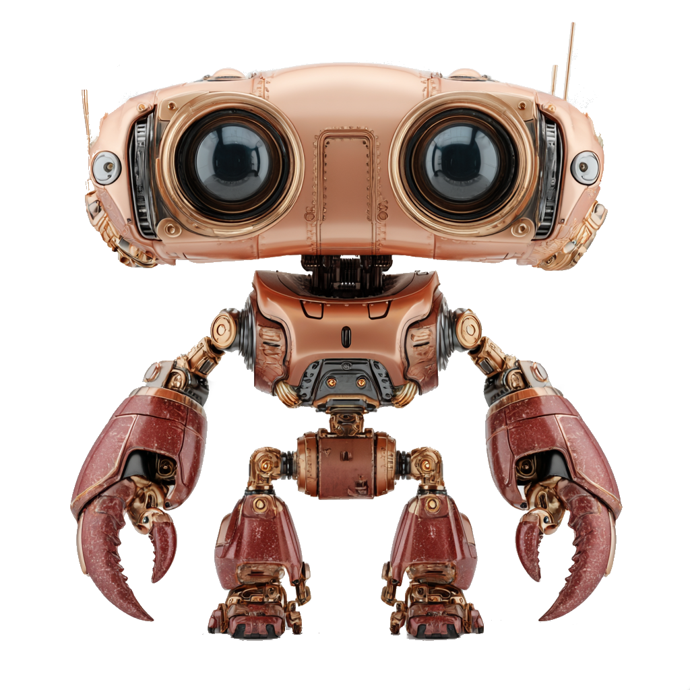
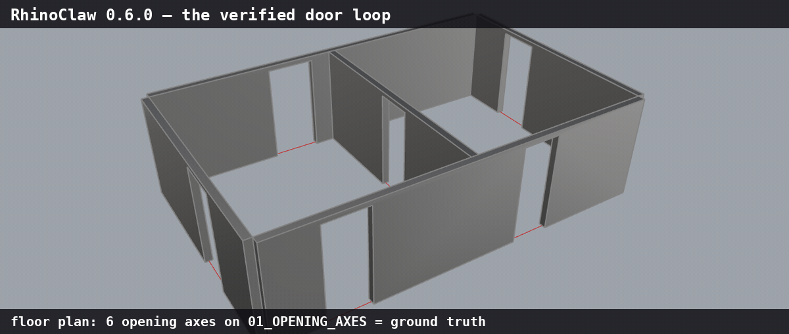

<p align="center">
  
</p>

# RhinoClaw - AI-Powered Rhino 3D Automation via MCP


[](https://clawhub.ai/McMuff86/rhinoclaw)


RhinoClaw connects **Rhino 3D** to AI agents through the **Model Context Protocol (MCP)**, enabling prompt-assisted 3D modeling, automation, and parametric design. With **126 MCP tools**, it's the most comprehensive Rhino-AI integration available — and the only one whose door-placement vertical is **judge-verified and self-improving** (see [Reliability](#reliability--the-verified-door-loop)).



*Live capture: an agent places 6 doors on a real floor plan — rotations recalled from judge-verified outcomes, every placement re-measured against the opening-axis ground truth.*

## What Can You Do?

- 🗣️ **Talk to Rhino** — Create and modify 3D geometry with natural language
- 🔧 **Automate workflows** — Boolean operations, transforms, arrays, materials
- 🏗️ **BIM workflows** — VisualARQ integration for walls, doors, windows, levels, IFC export (optional dependency)
- 🦗 **Grasshopper integration** — Author `.gh` definitions programmatically; parametric headless bake via native-component recipes (`build_and_bake_recipe`). Note: GH *script* components (Python 3 / GhPython) don't solve headless on Rhino 8 — use recipes or `execute_rhinoscript_python_code` for guaranteed geometry
- 📸 **Capture & render** — Viewport screenshots, render settings, camera control
- 📦 **Full pipeline** — Import/export, layers, groups, blocks, mesh operations

## Reliability — the verified door loop

RhinoClaw's door vertical doesn't trust the agent's own success claims.
Every placement is **measured**: the judge re-reads the baked geometry and
scores it against independently drawn opening axes (off-center, axis,
width). Verified outcomes feed a deterministic recall — so the system
**measurably improves**:

| Door-placement benchmark — 12 openings, **live Rhino 8** | COLD (no memory) | WARM (with recall) |
|---|---|---|
| First-try success | **50%** | **100%** |
| Mean axis error (first try) | 45.0° | 0.0° |
| Final success (judge-hint retries) | 100% | 100% |

Reproduce it yourself:

```bash
cd rhinoclaw_server
uv run python bench/door_bench.py               # simulated, deterministic
uv run python bench/door_bench.py --mode live   # against a running Rhino
```

The benchmark ships with this repo (`rhinoclaw_server/tests/test_door_bench.py`)
and is CI-gated upstream on every change — an orientation regression in the
judge or a recall regression fails the build.

## Quick Start

### 1. Install the Rhino Plugin

In Rhino: **Tools → Package Manager → Search "rhinoclaw" → Install**

### 2. Install UV (Python package manager)

```bash
# macOS
brew install uv

# Windows
powershell -c "irm https://astral.sh/uv/install.ps1 | iex"
```

### 3. Configure Your AI Client

Add to your MCP config file:

```json
{
  "mcpServers": {
    "rhino": {
      "command": "uvx",
      "args": ["rhinoclaw"]
    }
  }
}
```

**Config file locations:**
- **Claude Desktop:** Claude → Settings → Developer → Edit Config
- **Cursor:** Create `.cursor/mcp.json` in your project root
- **Other MCP clients:** See their documentation for config file location

### 4. Connect

1. In Rhino, type `mcpstart` in the command line
2. Your AI client should show RhinoClaw tools as available

> **⚠️ Run only one MCP server instance** (either Cursor or Claude Desktop, not both)

### Alternative: OpenClaw Integration

If you use [OpenClaw](https://openclaw.ai), install the RhinoClaw **AgentSkill** from [ClawHub](https://clawhub.ai/McMuff86/rhinoclaw):

```bash
npx clawhub@latest install rhinoclaw
```

Then configure the skill:

```bash
cd skills/rhinoclaw
cp config.example.json config.json
# Edit config.json with your Rhino host IP
```

In Rhino, type `tcpstart` (instead of `mcpstart`) for remote/WSL access. Your OpenClaw agent can now control Rhino directly — geometry, materials, Grasshopper, VisualARQ, everything.

> **ClawHub page:** [clawhub.ai/McMuff86/rhinoclaw](https://clawhub.ai/McMuff86/rhinoclaw)

## First 5 minutes — place a verified door

Once connected, ask your agent (or call the tools directly):

1. **`rhinoclaw_doctor`** — six checks (connection, auth, versions,
   Grasshopper, WSL host, outcome corpus); every FAIL comes with the exact
   fix. Don't debug by hand — run this first.
2. **`recall_placements(door_type="Rahmentuer_UD5.gh", wall_axis="x")`** —
   cold start returns "use defaults"; after one verified run it returns the
   best known rotation/width.
3. **`place_doors`** — place a door batch; the result reports real
   `object_ids` + `baked_bbox` measured from the document.
4. **`judge_door_placement`** — verdict per door (`pass`, `off_center_mm`,
   `axis_deg_error`, `width_error_mm`) + an actionable hint on failure.
   Each verdict feeds the recall corpus — step 2 gets smarter every run.

## Features (126 Tools)

| Category | Tools | Examples |
|----------|-------|---------|
| **Geometry Creation** | 13 types | Box, Sphere, Cylinder, Cone, Surface, Mesh, Points, Curves, Arcs, Ellipses |
| **Object Modification** | Modify, Properties, Selection | Rename, recolor, move to layer, batch operations |
| **Transforms** | Copy, Mirror, Arrays | Linear array, polar array, transform operations |
| **Boolean Operations** | Union, Difference, Intersection | Solid modeling workflows |
| **Curve & Surface** | Offset, Fillet, Chamfer, Loft, Extrude, Revolve | Complex surface creation |
| **Materials & Rendering** | PBR Materials, Layer Materials, Render Settings | Full material pipeline |
| **Layers & Organization** | Create, Delete, Set Current | Layer management |
| **Viewport** | Camera, Orbit, Zoom, Capture, Render | Screenshots, view control |
| **Groups & Blocks** | Create, Ungroup, Insert, Explode | Object hierarchies |
| **Grasshopper** | SDK, Player, Build, Bake | Parametric automation |
| **GH Definition Builder** | Build .gh files programmatically | Python 3 Script nodes, sliders, auto-wiring |
| **VisualARQ BIM** | Walls, Doors, Windows, Levels, IFC | Complete BIM workflow (optional dependency) |
| **File Operations** | Open, Save, Import, Export | Multiple format support |
| **Mesh Operations** | Import, Export, Convert | Mesh processing |
| **Script Execution** | Python, RhinoScript | Custom automation |
| **Dimensions** | Create dimensions, Query properties | Annotation tools |
| **ERP Integration** | RhinoERPBridge coupling | Article search, BOM collect & validate (`erp_list_tools` / `erp_invoke`) |

## Grasshopper Definition Builder

Build parametric Grasshopper definitions entirely from your AI agent:

```
"Create a parametric table with adjustable width, depth, height, 
leg taper, and overhang. Bake it to a layer called 'Furniture'."
```

RhinoClaw can:
- Create Python 3 Script components with custom I/O
- Add Number Sliders, Boolean Toggles, Panels
- Wire components together automatically
- Solve and bake to named layers with materials
- Use colour presets (wood, oak, walnut, steel, glass...)

**Included templates:** Parametric Chair, Table, Shelf, TwistedTower

## ClawChat — AI Chat Inside Rhino

Built-in chat panel directly in Rhino 8:
- Works with OpenClaw, Hermes, Open WebUI, LibreChat, Ollama, or any custom endpoint
- Each built-in surface keeps its own URL override — switching presets never loses your endpoints
- Persistent settings, one-click setup
- Command: `ClawChat` in Rhino

## Architecture

```
┌─────────────────┐     TCP:1999     ┌──────────────────┐
│   AI Agent       │ ◄──────────────► │   MCP Server     │
│ (Claude/Cursor)  │                  │   (Python)       │
└─────────────────┘                  └────────┬─────────┘
                                              │
                                     ┌────────▼─────────┐
                                     │   Rhino Plugin   │
                                     │   (C# / .NET)    │
                                     └──────────────────┘
```

- **MCP Server** (`rhinoclaw_server/`): Python, FastMCP — handles tool routing
- **Rhino Plugin** (`plugin/`, prebuilt `.rhp`): C#, RhinoCommon — executes commands in Rhino
- **Transport**: JSON over TCP (port 1999), WebSocket monitoring (port 2000)

## Requirements

- **Rhino 7+** (Windows and Mac) — keep Rhino up to date
- **Python 3.10+**
- **UV** package manager

**Optional Dependencies:**
- **VisualARQ** — For BIM workflows (walls, doors, windows, IFC). RhinoClaw works without VisualARQ installed.

## Security

RhinoClaw exposes a local TCP server that accepts arbitrary Python execution
from its clients. The default `mcpstart` command binds to `127.0.0.1` only,
which is safe for single-user machines. The optional `tcpstart` command binds
to `0.0.0.0` for WSL/LAN access — for that mode, set `RHINOCLAW_AUTH_TOKEN`
on both sides (Rhino host and AI client) to require a shared secret on every
command.

## Configuration

All connection settings can be overridden via environment variables (set
on both the Rhino host and the AI client):

| Variable | Default | Purpose |
|----------|---------|---------|
| `RHINOCLAW_HOST` | `127.0.0.1` | TCP host the Python client connects to |
| `RHINOCLAW_PORT` | `1999` | TCP port |
| `RHINOCLAW_TIMEOUT` | `15.0` | Per-command timeout in seconds |
| `RHINOCLAW_MAX_TIMEOUT` | `120.0` | Hard cap honoured by `send_command` |
| `RHINOCLAW_AUTH_TOKEN` | unset | Shared secret enforced by the plugin when set |
| `RHINOCLAW_LOG_FORMAT` | `text` | `text` or `json` |
| `RHINOCLAW_LOG_DIR` | OS state dir | Where interaction logs are written |
| `RHINOCLAW_DEBUG` | `false` | Verbose logs |

## Development

```bash
cd rhinoclaw_server

# Run tests (583 pass Rhino-free; 5 skip without a live Rhino)
uv run --extra dev pytest tests/ -v

# Build the Python package
uv build
```

## Contributing

Contributions welcome! Please open an issue or submit a Pull Request:
[github.com/McMuff86/rhinoclaw-release/issues](https://github.com/McMuff86/rhinoclaw-release/issues)

## License

MIT License — See [LICENSE](LICENSE) for details.

## Author

Created by [Solid AI](https://solid-ai.ai) · [McMuff86](https://github.com/McMuff86)
